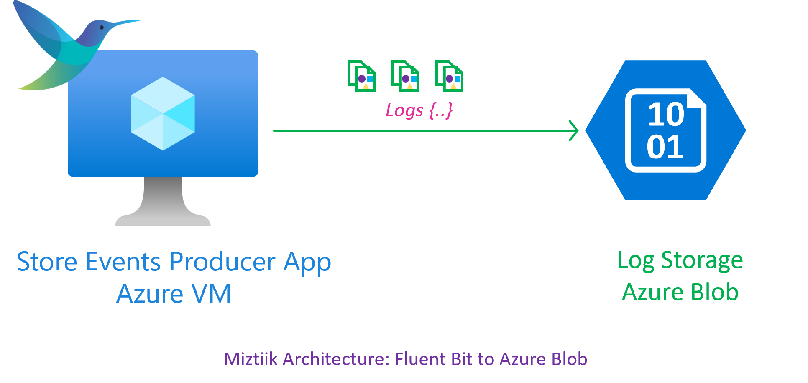
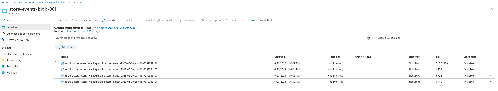

# FluentBit to Azure Blob

1. Install Fluent Bit

```bash

curl https://raw.githubusercontent.com/fluent/fluent-bit/master/install.sh | sh
```

1. Configure Fluent Bit

Update the `/etc/fluent-bit/fluent-bit.conf` file with the following content. Remember to modify the `account_name` and `shared_key` with your own values.

```bash
[SERVICE]
    flush                   1
    daemon                  Off
    log_level               debug
    parsers_file            parsers.conf

[INPUT]
    Name                    tail
    Tag                     miztiik-store-events-*
    path                    /var/log/miztiik-store-events-*.json
    Read_from_Head          true
    Skip_Empty_Lines        On

[OUTPUT]
    name                    azure_blob
    match                   *
    account_name            warehousene4b5pb6001
    shared_key              KD9Hv5UyTKJQj5QUJ+AStaybAyA==
    path                    log-events
    container_name          store-events-blob-001
    blob_type               blockblob
    auto_create_container   on
    tls                     on
```

1. Restart Fluent Bit

```bash
systemctl restart fluent-bit
systemctl status fluent-bit
# For Troubleshooting
# /opt/fluent-bit/bin/fluent-bit -c //etc/fluent-bit/fluent-bit.conf
```

1. Trigger the data generator

```bash
python3 data_gen.py
```



